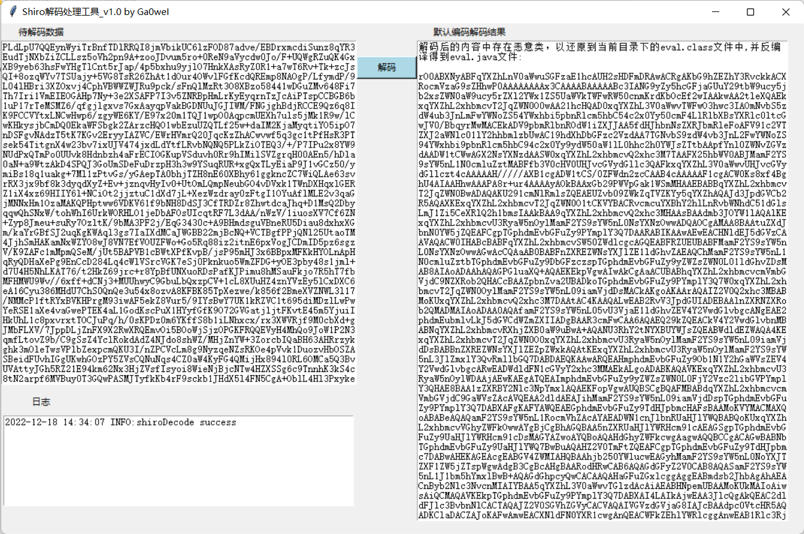

一款简洁的shiro解码工具

作者在使用之前的一些工具的时候发现，存在一些问题，比如有些工具解码模式不全，不支持shiro大于1.4.2版本的解码(AES-GCM模式)；再比如，大部分工具对payload中的恶意类不支持自动还原恶意类；再比如关于默认编码的收集不全；再比如，有些工具还支持shiro本身不支持的模式来解码（这个指的模式是AES-CBC-NOPadding）等。所以就寻思自己简单写了这个小工具。

这个工具其支持的解码方式严格按照shiro对解码的实现来（shiro<1.4.2用的是AES-ECB-PKCS5Padding，shiro>=1.4.2用的是AES-GCM模式），内置的密钥个数300+（经过实战（入侵检测）发现基本全覆盖），支持自动发现其中的恶意类，当存在使用TemplateImpl链的时候，可以自动还原出其bytescode属性中的字节码类，并反编译。

工具使用效果如下，右侧是解码后的内容，其为base64编码格式呈现并没有强转成ascii，主要是为了方便使用的人后续拓展操作。

2023年1月10日，更新v2版本：

   1、修复gcm模式解密后，如果存在恶意类，不会自动反编译bug；
   2、当解码成功时，解码日志里面，提供使用的默认密钥
